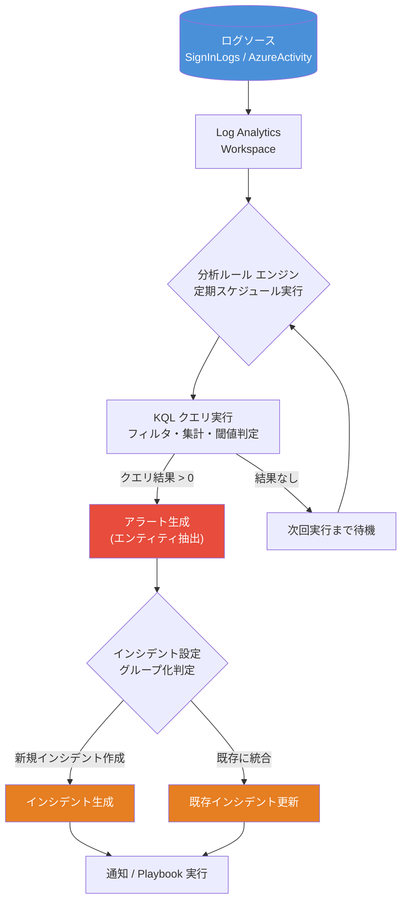
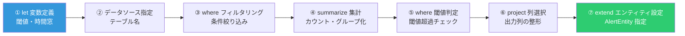
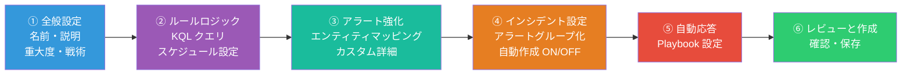
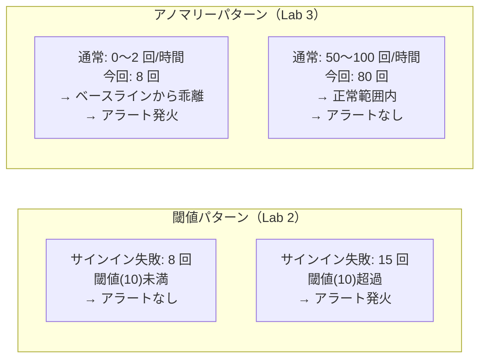
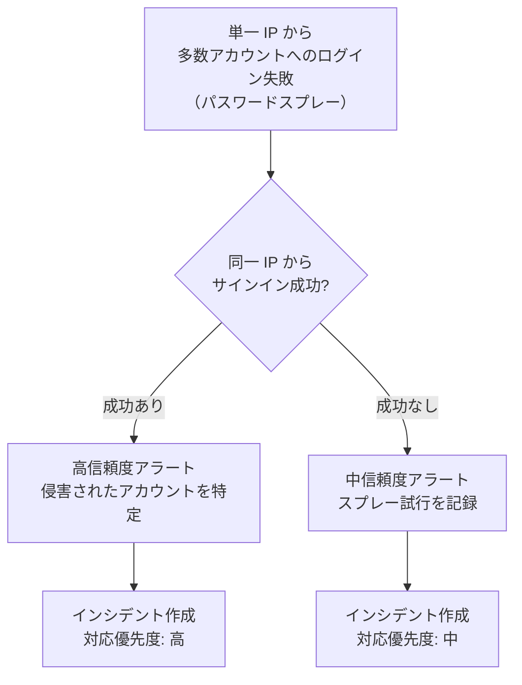
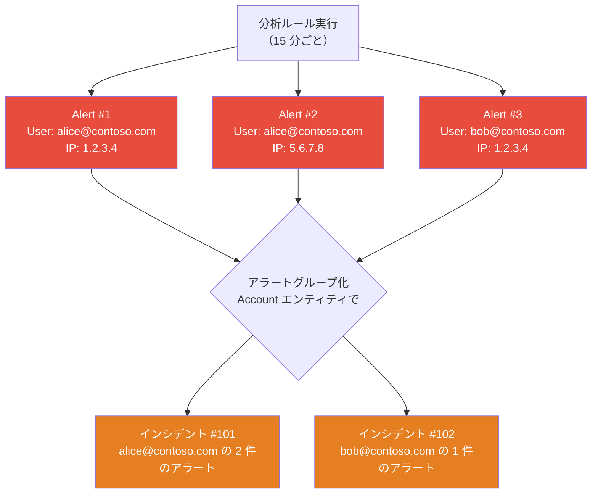
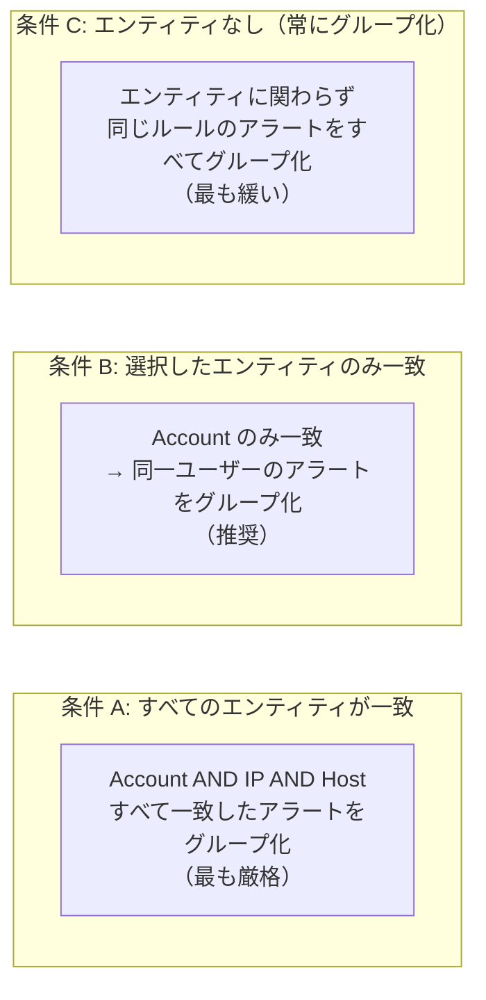

# Microsoft Sentinel 分析ルール ワークショップ

> **対象者**: Microsoft Sentinel の基本操作に慣れた方  
> **所要時間**: 1〜2 時間  
> **前提条件**: Microsoft Sentinel ワークスペース、SignInLogs・AzureActivity の診断設定が有効

---

## アジェンダ

| 時間 | 内容 |
|------|------|
| 0:00〜0:10 | イントロダクション・環境確認 |
| 0:10〜0:25 | 分析ルール概要・基本手順 |
| 0:25〜0:45 | Lab 1: Azure VM 再起動検知（特定条件） |
| 0:45〜1:05 | Lab 2: EntraID サインイン失敗閾値アラート（閾値） |
| 1:05〜1:25 | Lab 3: 異常なサインインボリューム検知（アノマリー） |
| 1:25〜1:35 | Lab 4: Azure RBAC 特権ロール割り当て検知（特定条件） |
| 1:35〜1:45 | Lab 5: 大量リソース削除検知（閾値） |
| 1:45〜1:55 | 応用 Lab: 脅威アクター（パスワードスプレー）検知 |
| 1:55〜2:00 | アラートグループ機能の設定 |

---

## 1. 分析ルール概要

### 1.1 分析ルールとは

Microsoft Sentinel の**分析ルール**は、Log Analytics ワークスペースに収集されたログに対して定期的に KQL クエリを実行し、条件に合致した場合に**アラート**と**インシデント**を自動生成する機能です。

| 項目 | 内容 |
|------|------|
| ルールの種類 | スケジュール済み / NRT (ほぼリアルタイム) / Microsoft Security / Fusion / Anomaly |
| 実行間隔 | 5 分〜1 日（スケジュール済みルール） |
| 参照期間 | クエリルックバック期間（最大 14 日） |
| 出力 | アラート → インシデント |

### 1.2 分析ルール処理フロー



### 1.3 KQL クエリ設計パターン

分析ルールで使用する KQL は次の構造で記述します。



---

## 2. 分析ルール作成 基本手順

### 2.1 作成ウィザードの流れ



### 2.2 操作手順

1. Azure Portal で **Microsoft Sentinel** を開く
2. 左メニュー「**構成**」→「**分析**」→「**＋ 作成**」→「**スケジュール済みクエリ ルール**」をクリック
3. 各タブの設定を順に入力する（詳細は各 Lab で説明）
4. 「**レビューと作成**」でルールを保存する

> **メモ**: NRT（ほぼリアルタイム）ルールはクエリ実行間隔が 1 分程度に短縮されます。アラート生成数の増加に注意してください。

---

## Lab 1: Azure VM 再起動検知（特定条件パターン）

### シナリオ概要

Azure 上の仮想マシンが**再起動操作**を受けた際にアラートを生成します。不正な操作や誤操作によるサービス停止を早期に検知することが目的です。

- **データソース**: `AzureActivity`
- **パターン**: 特定の操作名が記録されたかどうかを判定する「特定条件パターン」
- **エンティティ**: 操作者アカウント・発信元 IP アドレス

### KQL クエリ

```kql
// ===== パラメータ設定（let で変更しやすく） =====
let lookbackTime   = 1d;           // 過去何日分を参照するか
let targetAction   = "MICROSOFT.COMPUTE/VIRTUALMACHINES/RESTART/ACTION";
// ================================================

AzureActivity
| where TimeGenerated >= ago(lookbackTime)
| where OperationNameValue =~ targetAction     // 仮想マシン再起動操作
| where ActivityStatusValue == "Success"        // 成功したもののみ
| project
    TimeGenerated,
    SubscriptionId,
    ResourceGroup,
    Resource,                                   // VM 名
    Caller,                                     // 操作を実行したアカウント
    CallerIpAddress,
    ActivityStatusValue,
    OperationNameValue
| extend AccountCustomEntity = Caller           // エンティティ: アカウント
| extend IPCustomEntity       = CallerIpAddress // エンティティ: IP アドレス
| order by TimeGenerated desc
```

**クエリのポイント**:

| 行 | 説明 |
|----|------|
| `let lookbackTime` | 過去 1 日分を対象。`1h` や `7d` に変更するだけで調整可能 |
| `=~` 演算子 | 大文字・小文字を区別しない一致（AzureActivity の OperationNameValue は大文字で格納される） |
| `ActivityStatusValue == "Success"` | 成功した操作のみ対象。失敗操作も含める場合はこの行を削除 |
| `extend AccountCustomEntity` | Sentinel がアラートのエンティティとして認識する特殊列名 |

### 分析ルール作成手順

#### ① 全般設定タブ

| 項目 | 設定値 |
|------|--------|
| 名前 | `Azure VM 再起動検知` |
| 説明 | Azure 仮想マシンの再起動操作を検知します。 |
| 重大度 | 中 (Medium) |
| 戦術と手法 | Impact > T1529 System Shutdown/Reboot |
| 状態 | 有効 |

#### ② ルールロジックタブ

1. 「**ルール クエリ**」に上記 KQL を貼り付ける
2. 「**クエリのスケジュール設定**」
   - 実行間隔: **5 分ごと**
   - データの参照: **過去 1 日**
3. 「**クエリ結果の警告しきい値**」
   - 次の場合にアラートを生成: **より大きい** → `0`

#### ③ アラート強化タブ（エンティティマッピング）

「**＋ 新しいエンティティの追加**」で以下を設定:

| エンティティ | 種類 | 識別子 | 列名 |
|-------------|------|--------|------|
| アカウント | Account | FullName | Caller |
| IP アドレス | IP | Address | CallerIpAddress |

「**カスタム詳細**」でアラートに追加情報を含める:

| キー | 値（列名） |
|------|-----------|
| ResourceGroup | ResourceGroup |
| VMName | Resource |

#### ④ インシデント設定タブ

- インシデントの自動作成: **有効**
- アラートのグループ化: 後述の「グループ機能」セクションで詳しく設定

---

## Lab 2: EntraID サインイン失敗閾値アラート（閾値パターン）

### シナリオ概要

同一ユーザーに対して短時間に**多数のサインイン失敗**が発生した場合にアラートを生成します。ブルートフォース攻撃や資格情報スタッフィング攻撃の早期検知を目的とします。

- **データソース**: `SignInLogs`
- **パターン**: 集計値が閾値を超えたかどうかを判定する「閾値パターン」
- **エンティティ**: ユーザーアカウント・発信元 IP アドレス

### KQL クエリ

```kql
// ===== パラメータ設定（let で変更しやすく） =====
let lookbackTime     = 1d;    // 過去何日分を参照するか
let timeWindow       = 15m;   // 集計する時間窓（bin の単位）
let failureThreshold = 10;    // 警告を発するサインイン失敗回数の閾値
// ================================================

SignInLogs
| where TimeGenerated >= ago(lookbackTime)
| where ResultType != 0                          // 失敗したサインインのみ (ResultType=0 は成功)
| where ResultType !in ("50074", "50076")        // 多要素認証プロンプトは除外
| summarize
    FailureCount   = count(),
    FirstFailure   = min(TimeGenerated),
    LastFailure    = max(TimeGenerated),
    IPAddresses    = make_set(IPAddress, 10),     // 最大 10 件の IP を収集
    Apps           = make_set(AppDisplayName, 5), // 対象アプリ一覧
    ErrorCodes     = make_set(ResultType, 5)      // エラーコード一覧
    by UserPrincipalName, bin(TimeGenerated, timeWindow)
| where FailureCount >= failureThreshold          // 閾値判定
| project
    LastFailure,
    UserPrincipalName,
    FailureCount,
    IPAddresses,
    Apps,
    ErrorCodes,
    WindowStart = bin(LastFailure, timeWindow)
| extend AccountCustomEntity = UserPrincipalName
| order by FailureCount desc
```

**クエリのポイント**:

| 行 | 説明 |
|----|------|
| `let failureThreshold = 10` | ここを変更するだけで閾値を調整可能 |
| `let timeWindow = 15m` | `bin()` で集計する時間窓。`1h` や `30m` に変更可能 |
| `ResultType !in ("50074", "50076")` | MFA チャレンジなど正常な「失敗」を除外 |
| `make_set(IPAddress, 10)` | 複数 IP からの攻撃を 1 つのアラートで把握できるよう集約 |
| `bin(TimeGenerated, timeWindow)` | 時間窓ごとにグループ化して集計 |

### 分析ルール作成手順

#### ① 全般設定タブ

| 項目 | 設定値 |
|------|--------|
| 名前 | `EntraID サインイン失敗閾値アラート` |
| 重大度 | 中 (Medium) |
| 戦術と手法 | Credential Access > T1110 Brute Force |

#### ② ルールロジックタブ

- 実行間隔: **15 分ごと**
- データの参照: **過去 1 日**
- アラートしきい値: **より大きい → 0**

#### ③ アラート強化タブ

**エンティティマッピング**:

| エンティティ | 識別子 | 列名 |
|-------------|--------|------|
| Account | FullName | UserPrincipalName |
| IP | Address | ← `IPAddresses` は配列のため個別マッピング不可。カスタム詳細で対応 |

**カスタム詳細**:

| キー | 列名 |
|------|------|
| FailureCount | FailureCount |
| IPAddresses | IPAddresses |
| TargetApps | Apps |

**アラートの詳細**（動的タイトル）:

- アラート名の形式: `EntraID サインイン失敗アラート - {{UserPrincipalName}} ({{FailureCount}} 回)`

---

## Lab 3: 異常なサインインボリューム検知（アノマリーパターン）

### シナリオ概要

ユーザーのサインイン失敗回数が**過去の統計的な傾向から大きく逸脱**した場合にアラートを生成します。固定閾値ではなく機械学習ベースの異常検知を使用することで、活動パターンが異なるユーザーにも対応できます。

- **データソース**: `SignInLogs`
- **パターン**: KQL の `series_decompose_anomalies` を用いた「アノマリーパターン」
- **エンティティ**: ユーザーアカウント

### 閾値パターンとアノマリーパターンの違い



### KQL クエリ

```kql
// ===== パラメータ設定（let で変更しやすく） =====
let lookbackPeriod      = 14d;   // 統計ベースライン計算に使う期間
let timeInterval        = 1h;    // 時系列の集計単位
let anomalyThreshold    = 2.5;   // 異常スコアのしきい値（高いほど感度が下がる）
let detectionLookback   = 1d;    // アラートとして出力する直近期間
// ================================================

SignInLogs
| where TimeGenerated >= ago(lookbackPeriod)
| where ResultType != 0                         // 失敗したサインインのみ
| make-series
    FailureCount = count()
    on TimeGenerated
    from ago(lookbackPeriod) to now()
    step timeInterval
    by UserPrincipalName
| extend (anomalies, score, baseline) =
    series_decompose_anomalies(
        FailureCount,         // 分析する時系列データ
        anomalyThreshold,     // 異常スコアのしきい値
        -1,                   // 季節性の自動検出
        "linefit"             // トレンド除去方法
    )
| mv-expand
    TimeGenerated to typeof(datetime),
    FailureCount  to typeof(long),
    anomalies     to typeof(int),
    score         to typeof(double),
    baseline      to typeof(double)
| where anomalies == 1                          // 異常と判定されたポイントのみ
| where TimeGenerated >= ago(detectionLookback) // 直近期間のアノマリーのみ出力
| project
    TimeGenerated,
    UserPrincipalName,
    FailureCount,
    AnomalyScore  = round(score, 2),
    Baseline      = round(baseline, 1)
| extend AccountCustomEntity = UserPrincipalName
| order by AnomalyScore desc
```

**クエリのポイント**:

| 行 | 説明 |
|----|------|
| `let lookbackPeriod = 14d` | ベースライン計算のための学習期間。短くすると感度が変わる |
| `make-series` | 時系列データを等間隔の配列に変換する KQL 固有の構文 |
| `series_decompose_anomalies` | 時系列を「トレンド + 季節性 + 残差」に分解し、残差が閾値を超えた点を異常と判定 |
| `anomalyThreshold = 2.5` | 標準偏差の何倍の乖離を異常とするか。値を下げると感度が上がる（誤検知も増加） |
| `mv-expand` | `make-series` で生成された配列を行に展開する |

### 分析ルール作成手順

#### ② ルールロジックタブ（重要な設定）

`series_decompose_anomalies` は長期間のデータが必要なため：

- 実行間隔: **1 時間ごと**
- **データの参照: 過去 14 日**（ベースライン計算期間と一致させる）
- アラートしきい値: **より大きい → 0**

> **注意**: クエリのルックバック期間を 14 日に設定すると、クエリ実行コストが増加します。本番環境では利用頻度の高いユーザーに絞り込むフィルタの追加を検討してください。

---

## Lab 4: Azure RBAC 特権ロール割り当て検知（特定条件パターン）

### シナリオ概要

Azure サブスクリプション上で**高権限の RBAC ロール**（Owner / User Access Administrator / Contributor など）が割り当てられた際にアラートを生成します。権限昇格攻撃や不正な管理者追加を検知します。

- **データソース**: `AzureActivity`
- **パターン**: 特定操作名の発生を検知する「特定条件パターン」
- **エンティティ**: 操作者アカウント・発信元 IP アドレス

### KQL クエリ

```kql
// ===== パラメータ設定（let で変更しやすく） =====
let lookbackTime    = 1d;
let sensitiveScopes = dynamic(["/"]); // 監視するスコープ（"/" = サブスクリプション全体）
// ================================================

AzureActivity
| where TimeGenerated >= ago(lookbackTime)
| where OperationNameValue =~ "MICROSOFT.AUTHORIZATION/ROLEASSIGNMENTS/WRITE"
| where ActivityStatusValue == "Success"
| extend Properties_parsed  = parse_json(Properties)
| extend RoleDefinitionId   = tostring(Properties_parsed.roleDefinitionId)
| extend PrincipalId        = tostring(Properties_parsed.principalId)
| extend PrincipalType      = tostring(Properties_parsed.principalType)
| extend Scope              = tostring(Properties_parsed.scope)
| project
    TimeGenerated,
    Caller,                             // 操作を実行したアカウント（割り当てを行った人）
    CallerIpAddress,
    ResourceGroup,
    SubscriptionId,
    RoleDefinitionId,                   // 割り当てられたロールの定義 ID
    PrincipalId,                        // ロールが割り当てられた対象の Object ID
    PrincipalType,                      // User / ServicePrincipal / Group
    Scope,                              // スコープ（サブスクリプション / RG / リソース）
    ActivityStatusValue
| extend AccountCustomEntity = Caller
| extend IPCustomEntity       = CallerIpAddress
| order by TimeGenerated desc
```

> **補足**: Entra ID のディレクトリロール割り当て（Global Administrator 等）を検知する場合は `AuditLogs` テーブルで `OperationName == "Add member to role"` を使用します。

### 分析ルール作成手順

#### ① 全般設定タブ

| 項目 | 設定値 |
|------|--------|
| 名前 | `Azure 特権 RBAC ロール割り当て検知` |
| 重大度 | 高 (High) |
| 戦術と手法 | Privilege Escalation > T1078 Valid Accounts |

#### ③ アラート強化タブ（カスタム詳細）

| キー | 列名 |
|------|------|
| AssignedRoleId | RoleDefinitionId |
| TargetPrincipalId | PrincipalId |
| TargetScope | Scope |

---

## Lab 5: 大量リソース削除検知（閾値パターン）

### シナリオ概要

Azure 上で同一ユーザーが短時間に**複数のリソースを削除**した場合にアラートを生成します。ランサムウェアによるリソース破壊や、インサイダー脅威による意図的なデータ消去を想定しています。

- **データソース**: `AzureActivity`
- **パターン**: 削除操作数が閾値を超えた場合の「閾値パターン」
- **エンティティ**: 操作者アカウント・発信元 IP アドレス

### KQL クエリ

```kql
// ===== パラメータ設定（let で変更しやすく） =====
let lookbackTime       = 1d;
let timeWindow         = 1h;    // 集計する時間窓
let deletionThreshold  = 5;     // この件数以上の削除でアラート
// ================================================

AzureActivity
| where TimeGenerated >= ago(lookbackTime)
| where OperationNameValue endswith "/DELETE"   // DELETE 操作すべてに一致
| where ActivityStatusValue == "Success"
| summarize
    DeletionCount   = count(),
    Resources       = make_set(Resource, 30),       // 削除されたリソース一覧
    ResourceTypes   = make_set(OperationNameValue, 10),
    FirstDeletion   = min(TimeGenerated),
    LastDeletion    = max(TimeGenerated)
    by Caller, CallerIpAddress, bin(TimeGenerated, timeWindow)
| where DeletionCount >= deletionThreshold       // 閾値判定
| extend DurationMinutes = datetime_diff("minute", LastDeletion, FirstDeletion)
| project
    LastDeletion,
    Caller,
    CallerIpAddress,
    DeletionCount,
    DurationMinutes,
    Resources,
    ResourceTypes
| extend AccountCustomEntity = Caller
| extend IPCustomEntity       = CallerIpAddress
| order by DeletionCount desc
```

**クエリのポイント**:

| 行 | 説明 |
|----|------|
| `endswith "/DELETE"` | 全リソースタイプの削除操作を 1 つのパターンで網羅 |
| `let deletionThreshold = 5` | 正常な運用での削除数に合わせて調整 |
| `DurationMinutes` | 削除が何分間に集中していたかを算出し、インシデント調査を支援 |

### 分析ルール作成手順

#### ① 全般設定タブ

| 項目 | 設定値 |
|------|--------|
| 名前 | `Azure 大量リソース削除検知` |
| 重大度 | 高 (High) |
| 戦術と手法 | Impact > T1485 Data Destruction |

#### ② ルールロジックタブ

- 実行間隔: **1 時間ごと**
- データの参照: **過去 1 日**

---

## 応用 Lab: 脅威アクター検知 ― パスワードスプレー攻撃（Midnight Blizzard スタイル）

### 脅威アクターの概要

**Midnight Blizzard**（旧称: NOBELIUM / Cozy Bear / APT29）はロシアの国家支援型攻撃グループであり、以下の手法で Microsoft クラウド環境を標的にすることが知られています。

| 手法 | 説明 |
|------|------|
| パスワードスプレー | 少数のパスワードを多数のアカウントに試行し、アカウントロックを回避 |
| OAuth アプリ悪用 | 正規の OAuth アプリを利用して永続的なアクセスを確保 |
| トークン窃取 | セッショントークンを奪い MFA をバイパス |
| 特権アカウント侵害 | サービスプリンシパルや管理者アカウントを最終標的に |

### 検知シナリオ: パスワードスプレー成功検知

単一 IP から多数のアカウントへのサインイン失敗（スプレー）を検知し、その IP からの**サインイン成功が存在するか**を確認します。スプレー成功＝アカウント侵害の可能性が高いことを示します。



### KQL クエリ

```kql
// ===== パラメータ設定（let で変更しやすく） =====
let lookbackTime            = 1h;
let sprayFailureThreshold   = 20;   // 同一 IP からの失敗回数閾値
let uniqueAccountThreshold  = 10;   // 同一 IP が狙ったユニークアカウント数閾値
// ================================================

// ステップ 1: パスワードスプレーを行っている疑いのある IP を特定
let suspiciousIPs =
    SignInLogs
    | where TimeGenerated >= ago(lookbackTime)
    | where ResultType != 0
    | summarize
        FailureCount     = count(),
        UniqueAccounts   = dcount(UserPrincipalName),
        AccountList      = make_set(UserPrincipalName, 50),
        ErrorCodes       = make_set(ResultType, 5)
        by IPAddress
    | where FailureCount >= sprayFailureThreshold
        and UniqueAccounts >= uniqueAccountThreshold
    | project IPAddress, FailureCount, UniqueAccounts, AccountList, ErrorCodes;

// ステップ 2: そのスプレー元 IP からサインインに成功したアカウントを特定
let successFromSprayIP =
    SignInLogs
    | where TimeGenerated >= ago(lookbackTime)
    | where ResultType == 0
    | join kind=inner suspiciousIPs on IPAddress
    | project
        TimeGenerated,
        CompromisedUser  = UserPrincipalName,
        IPAddress,
        AppDisplayName,
        Location,
        AuthMethods      = AuthenticationDetails,
        SprayFailures    = FailureCount,
        SprayUniqueAccts = UniqueAccounts;

// ステップ 3: スプレー成功（侵害されたアカウント）を出力
successFromSprayIP
| extend
    AccountCustomEntity = CompromisedUser,
    IPCustomEntity      = IPAddress
| project
    TimeGenerated,
    CompromisedUser,
    IPAddress,
    AppDisplayName,
    Location,
    SprayFailures,
    SprayUniqueAccts
| order by TimeGenerated desc
```

**クエリのポイント**:

| 行 | 説明 |
|----|------|
| `dcount(UserPrincipalName)` | ユニークアカウント数でスプレーを検知（同一ユーザーへの多数試行と区別） |
| `join kind=inner suspiciousIPs on IPAddress` | スプレー元 IP に絞って成功ログインを検索 |
| `let suspiciousIPs = ...` | クエリをサブクエリ（let 変数）として分割し可読性を向上 |

### 分析ルール作成手順

#### ① 全般設定タブ

| 項目 | 設定値 |
|------|--------|
| 名前 | `[APT29 Style] パスワードスプレー成功検知` |
| 重大度 | **高 (High)** |
| 戦術と手法 | Credential Access > T1110.003 Password Spraying |
| MITRE ATT&CK | Initial Access > T1078 Valid Accounts |

#### ② ルールロジックタブ

- 実行間隔: **15 分ごと**（スプレー攻撃は短時間で完結する場合が多い）
- データの参照: **過去 1 時間**（`lookbackTime` と一致させる）

#### ③ アラート強化タブ

**エンティティマッピング**:

| エンティティ | 識別子 | 列名 |
|-------------|--------|------|
| Account | FullName | CompromisedUser |
| IP | Address | IPAddress |

**カスタム詳細**:

| キー | 列名 |
|------|------|
| SprayFailureCount | SprayFailures |
| AffectedAccountCount | SprayUniqueAccts |
| SignInLocation | Location |

---

## 3. アラートグループ機能の設定

### 3.1 グループ機能とは

Sentinel の分析ルールには、複数のアラートをまとめて 1 つのインシデントに集約する**アラートグループ化**機能があります。これは Microsoft Defender XDR の「相関分析」とは別の、Sentinel 固有の機能です。



### 3.2 設定手順

#### 手順 1: 分析ルールを開く

1. **Microsoft Sentinel** → **分析** を開く
2. 対象のルールを選択し、「**編集**」をクリックする
3. 「**インシデント設定**」タブを開く

#### 手順 2: アラートグループ化を有効にする

「**アラートのグループ化**」セクションで以下を設定します。

| 項目 | 説明 | 推奨設定（例） |
|------|------|---------------|
| グループ化の有効化 | アラートをインシデントにグループ化する | **有効** |
| グループ化のタイムウィンドウ | 何時間以内のアラートを同一インシデントにまとめるか | **5 時間** |
| 再オープンされた一致するインシデントへのアラートのグループ化 | 一度クローズされたインシデントを再オープンするか | 要件に応じて設定 |
| グループ化の条件 | どのエンティティが一致したときにグループ化するか | 下記参照 |

#### 手順 3: グループ化条件を選択する

グループ化条件には 3 つの選択肢があります。



**Lab ごとの推奨グループ化条件**:

| Lab | ルール名 | 推奨グループ化条件 | 理由 |
|-----|---------|-----------------|------|
| Lab 1 | VM 再起動検知 | Account エンティティで一致 | 同一操作者による複数 VM の再起動をまとめる |
| Lab 2 | サインイン失敗閾値 | Account エンティティで一致 | 同一ユーザーへの連続攻撃をまとめる |
| Lab 3 | サインインアノマリー | Account エンティティで一致 | 同一ユーザーの異常を集約する |
| Lab 4 | 特権ロール割り当て | すべてのエンティティで一致 | 個別のロール割り当てを個別インシデントとして追跡 |
| Lab 5 | 大量リソース削除 | Account エンティティで一致 | 同一攻撃者による削除活動をまとめる |
| 応用 | パスワードスプレー | IP エンティティで一致 | 同一スプレー元からの複数成功をまとめる |

#### 手順 4: 設定を保存する

「**次へ: 自動応答**」→「**次へ: レビューと作成**」→「**保存**」

> **注意**: グループ化を有効にすると、同一インシデントへのアラート集約が発生するため、インシデント数が減少します。調査効率は向上しますが、最初は緩めの設定で運用し、環境に合わせて調整してください。

### 3.3 イベントグループ化（Event Grouping）

「**ルールロジック**」タブにある「**イベントグループ化**」の設定も重要です。

| 設定値 | 動作 | 用途 |
|--------|------|------|
| 各行を個別のアラートにトリガー | クエリ結果の各行が独立したアラートになる | 個別リソースや個別ユーザーを精密に追跡したい場合 |
| すべてのイベントを 1 つのアラートにグループ化 | クエリ結果全体が 1 件のアラートになる | サマリーアラートとして概要を把握したい場合 |

Lab 2 のような `summarize` で集計済みのクエリは「各行を個別のアラート」が適切です。Lab 3 のようにアノマリーが複数ユーザーに同時発生する場合は「すべてを 1 つに」を選択してノイズを減らすこともできます。

---

## 4. まとめ

### ワークショップで学んだこと

| パターン | Lab | データソース | 主な KQL テクニック |
|---------|-----|-------------|-------------------|
| 特定条件 | Lab 1 / Lab 4 | AzureActivity | `where OperationNameValue =~`、`parse_json()` |
| 閾値 | Lab 2 / Lab 5 | SignInLogs / AzureActivity | `summarize count()`、`bin()`、`make_set()` |
| アノマリー | Lab 3 | SignInLogs | `make-series`、`series_decompose_anomalies()` |
| 複合（脅威アクター） | 応用 Lab | SignInLogs | `join kind=inner`、`let` サブクエリ |

### 設計のベストプラクティス

- **`let` 変数を活用する**: 閾値・時間窓・対象リストはすべて `let` で定義し、運用調整を容易にする
- **エンティティを必ず設定する**: アカウント・IP・ホストのエンティティを設定することでインシデント調査の自動エンリッチメントが機能する
- **カスタム詳細でコンテキストを追加する**: アラートに追加情報を埋め込み、インシデント画面での初動調査時間を短縮する
- **グループ化でノイズを削減する**: 適切なグループ化設定により、関連アラートをまとめて調査効率を上げる
- **まず少ない期間でテストする**: 新しいルールは最初に `lookbackTime = 1h` 程度でログ確認し、期待通りの結果が返ることを確認してから本番デプロイする

### 参考リソース

- [Microsoft Sentinel 分析ルールのドキュメント](https://learn.microsoft.com/ja-jp/azure/sentinel/detect-threats-custom)
- [Microsoft Sentinel KQL チートシート](https://learn.microsoft.com/ja-jp/azure/sentinel/kusto-quick-reference)
- [Midnight Blizzard に関するマイクロソフトのブログ](https://www.microsoft.com/security/blog/2024/01/25/midnight-blizzard-guidance-for-responders-on-nation-state-attack/)
- [MITRE ATT&CK Framework](https://attack.mitre.org/)
- [Sentinel GitHub リポジトリ（コミュニティルール）](https://github.com/Azure/Azure-Sentinel)

---

*Microsoft Sentinel 分析ルール ワークショップ — 作成日: 2026年4月*
